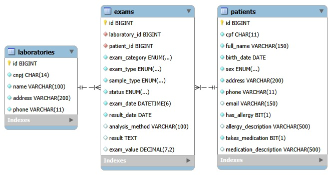
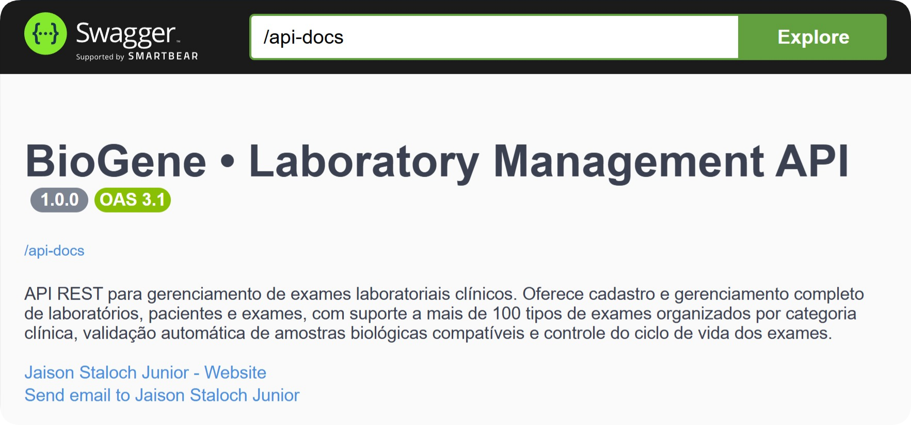

<div align="center">

# 🧬 BioGene — Sistema de Gestão Laboratorial


API REST completa para gerenciamento de pacientes, laboratórios e exames clínicos, com validações automáticas de regras de negócio, catálogo de exames e documentação interativa via Swagger UI.

</div>

---

## 📋 Índice

- [Visão Geral](#-visão-geral)
- [Tecnologias Utilizadas](#-tecnologias-utilizadas)
- [Modelagem de Dados](#-modelagem-de-dados)
  - [Diagrama ER](#diagrama-er)
  - [Entidades e Atributos](#entidades-e-atributos)
  - [Relacionamentos e Cardinalidades](#relacionamentos-e-cardinalidades)
  - [Chaves Primárias e Estrangeiras](#chaves-primárias-e-estrangeiras)
- [Estrutura do Projeto](#-estrutura-do-projeto)
  - [Organização de Pastas](#organização-de-pastas)
  - [Propósito de Cada Camada](#propósito-de-cada-camada)
  - [Mapeamento das Entidades](#mapeamento-das-entidades)
  - [Conexão Entre as Entidades](#conexão-entre-as-entidades)
  - [Restrições e Regras de Negócio](#restrições-e-regras-de-negócio)
  - [Problema Central](#problema-central)
- [Instalação e Configuração](#️-instalação-e-configuração)
- [Como Executar](#-como-executar)
- [API REST — Endpoints](#-api-rest--endpoints)
  - [Pacientes](#pacientes)
  - [Laboratórios](#laboratórios)
  - [Exames](#exames)
- [DTOs](#-dtos)
- [Testes](#-testes)
- [Tratamento de Exceções](#️-tratamento-de-exceções)

---

## 🌐 Visão Geral

O **BioGene** é uma API REST desenvolvida em Spring Boot que centraliza o gerenciamento de um laboratório clínico. O sistema resolve um problema real enfrentado por laboratórios de pequeno e médio porte: a gestão manual de pacientes, exames e resultados em planilhas e papéis, que gera perda de histórico, erros de registro e ausência de validações automáticas.

A solução oferece:

- Cadastro, consulta, atualização e remoção de **pacientes** com validações de CPF único, alergias e medicamentos
- Cadastro, consulta, atualização e remoção de **laboratórios** com proteção contra exclusão indevida
- Criação e gerenciamento completo de **exames** com controle de ciclo de vida por status
- **Catálogo** de mais de 100 tipos de exame organizados por categoria, com amostras compatíveis
- **Documentação interativa** via Swagger UI para consumo e teste dos endpoints
- **Validações automáticas** de regras de negócio em todas as operações

---

## 🛠 Tecnologias Utilizadas

| Tecnologia | Versão | Justificativa |
|---|---|---|
| Java | 21 | Versão LTS mais recente, com melhorias de performance e novos recursos de linguagem. |
| Spring Boot | 3.5.12 | Framework robusto para criação de APIs REST em Java, reduzindo configuração e acelerando o desenvolvimento. |
| Spring Data JPA | gerenciado pelo Boot | Abstração sobre Hibernate/JPA que elimina código boilerplate de acesso a dados. |
| Spring Validation | gerenciado pelo Boot | Integração com Bean Validation para validação declarativa nos DTOs de entrada. |
| MySQL | 8.0 | Banco relacional amplamente utilizado em produção, estável e com excelente integração com Spring. |
| H2 Database | gerenciado pelo Boot | Banco em memória utilizado exclusivamente nos testes de integração para isolamento e velocidade. |
| Lombok | gerenciado pelo Boot | Reduz código repetitivo como getters, setters e construtores, mantendo as entidades limpas. |
| SpringDoc OpenAPI | 2.8.6 | Gera automaticamente a documentação Swagger UI a partir das anotações do código. |
| JUnit 5 | 5.12.2 | Framework padrão da indústria para testes unitários em Java, gerenciado pelo Spring Boot. |
| Mockito | 5.17.0 | Framework de mocking para isolar dependências nos testes unitários, gerenciado pelo Spring Boot. |
| Maven | 3.9.14 | Gerenciador de dependências e build do projeto. |
| Maven Wrapper | 3.3.4 | Garante que qualquer desenvolvedor use a mesma versão do Maven sem instalação manual. |

---

## 🗄 Modelagem de Dados

### Diagrama Entidade-Relacionamento



O diagrama ER do BioGene representa três entidades principais — **Patient**, **Laboratory** e **Exam** — onde `Exam` é a entidade central, vinculando paciente e laboratório por meio de chaves estrangeiras.

Em relação à modelagem inicial da Etapa 1, as seguintes evoluções foram incorporadas na versão final:
- Adição do campo `examCategory` na entidade `Exam` para categorizar automaticamente os tipos de exame
- Enriquecimento do enum `ExamType` com metadados de amostra padrão e amostras compatíveis
- Adição dos campos `hasAllergy`, `allergyDescription`, `takesMedication` e `medicationDescription` na entidade `Patient`

---

### Entidades e Atributos

#### Patient (Paciente)

| Atributo | Tipo | Descrição |
|---|---|---|
| id (PK) | LONG | Identificador único, gerado automaticamente |
| cpf | CHAR(11) | CPF do paciente, único no sistema |
| fullName | VARCHAR(150) | Nome completo do paciente |
| birthDate | DATE | Data de nascimento |
| sex | ENUM(13) | Sexo biológico (enum: MASCULINO, FEMININO, INTERSEXO) |
| address | VARCHAR(200) | Endereço completo |
| phone | VARCHAR(11) | Telefone de contato |
| email | VARCHAR(150) | E-mail (opcional) |
| hasAllergy | BOOLEAN | Indica se o paciente possui alergia |
| allergyDescription | VARCHAR(500) | Descrição da alergia (obrigatória se hasAllergy = true) |
| takesMedication | BOOLEAN | Indica se o paciente faz uso de medicamento |
| medicationDescription | VARCHAR(500) | Descrição do medicamento (obrigatória se takesMedication = true) |

#### Laboratory (Laboratório)

| Atributo | Tipo | Descrição |
|---|---|---|
| id (PK) | LONG | Identificador único, gerado automaticamente |
| cnpj | CHAR(14) | CNPJ do laboratório, sem formatação |
| name | VARCHAR(100) | Nome do laboratório |
| address | VARCHAR(200) | Endereço completo |
| phone | VARCHAR(11) | Telefone de contato |

#### Exam (Exame)

| Atributo | Tipo | Descrição |
|---|---|---|
| id (PK) | LONG | Identificador único, gerado automaticamente |
| patient_id (FK) | LONG | Referência ao paciente |
| laboratory_id (FK) | LONG | Referência ao laboratório |
| examCategory | ENUM(25) | Categoria do exame (enum: BIOQUIMICA, HEMATOLOGIA, etc.) |
| examType | ENUM(40) | Tipo do exame (enum com 100+ tipos) |
| sampleType | ENUM(25) | Tipo de amostra coletada (enum) |
| status | ENUM(15) | Status do exame (enum: AGENDADO, COLETADO, EM_ANALISE, CONCLUIDO, CANCELADO) |
| examDate | DATETIME | Data e hora da coleta |
| resultDate | DATE | Data prevista de entrega do resultado |
| analysisMethod | VARCHAR(100) | Método de análise utilizado (opcional) |
| result | TEXT | Resultado do exame (preenchido apenas na conclusão) |
| examValue | DECIMAL(7,2) | Valor cobrado pelo exame (opcional) |

---

### Relacionamentos e Cardinalidades

O sistema possui dois relacionamentos do tipo **1:N (Um para Muitos)**:

- **Patient 1:N Exam** — Um paciente pode ter muitos exames, mas cada exame pertence a um único paciente.
- **Laboratory 1:N Exam** — Um laboratório pode realizar muitos exames, mas cada exame é realizado em um único laboratório.

```
Patient (1) ──────────────► (N) Exam
Laboratory (1) ───────────► (N) Exam
```

A entidade `Exam` é a dona dos dois relacionamentos, pois possui as chaves estrangeiras `patient_id` e `laboratory_id` em sua tabela.

---

### Chaves Primárias e Estrangeiras

| Chave | Entidade | Campo | Referência |
|---|---|---|---|
| PK | Patient | `id` | — |
| PK | Laboratory | `id` | — |
| PK | Exam | `id` | — |
| FK | Exam | `patient_id` | `Patient.id` |
| FK | Exam | `laboratory_id` | `Laboratory.id` |

---

## 📁 Estrutura do Projeto

### Organização de Pastas

```
src/
├── main/
│   ├── java/com/biogene/
│   │   ├── config/
│   │   │   └── OpenApiConfig.java
│   │   ├── controller/
│   │   │   ├── ExamController.java
│   │   │   ├── LaboratoryController.java
│   │   │   └── PatientController.java
│   │   ├── domain/
│   │   │   ├── Exam.java
│   │   │   ├── Laboratory.java
│   │   │   └── Patient.java
│   │   ├── dto/
│   │   │   ├── ExamCatalogCategoryDTO.java
│   │   │   ├── ExamCatalogTypeDTO.java
│   │   │   ├── ExamRequestDTO.java
│   │   │   ├── ExamResponseDTO.java
│   │   │   ├── LaboratoryRequestDTO.java
│   │   │   ├── LaboratoryResponseDTO.java
│   │   │   ├── PatientRequestDTO.java
│   │   │   └── PatientResponseDTO.java
│   │   ├── enums/
│   │   │   ├── ExamCategory.java
│   │   │   ├── ExamStatus.java
│   │   │   ├── ExamType.java
│   │   │   ├── SampleType.java
│   │   │   └── Sex.java
│   │   ├── exception/
│   │   │   ├── BusinessException.java
│   │   │   ├── DuplicateResourceException.java
│   │   │   ├── GlobalExceptionHandler.java
│   │   │   └── ResourceNotFoundException.java
│   │   ├── mapper/
│   │   │   ├── ExamMapper.java
│   │   │   ├── LaboratoryMapper.java
│   │   │   └── PatientMapper.java
│   │   ├── repository/
│   │   │   ├── ExamRepository.java
│   │   │   ├── LaboratoryRepository.java
│   │   │   └── PatientRepository.java
│   │   ├── service/
│   │   │   ├── ExamService.java
│   │   │   ├── LaboratoryService.java
│   │   │   └── PatientService.java
│   │   └── BiogeneApplication.java
│   └── resources/
│       └── application.properties
└── test/
    ├── java/com/biogene/service/
    │   ├── ExamIntegrationServiceTest.java
    │   ├── ExamServiceTest.java
    │   ├── LaboratoryIntegrationServiceTest.java
    │   ├── LaboratoryServiceTest.java
    │   ├── PatientIntegrationServiceTest.java
    │   └── PatientServiceTest.java
    └── resources/
        └── application-test.properties
```

---

### Propósito de Cada Camada

**`controller/`** — Camada de entrada da API. Recebe as requisições HTTP, valida os dados de entrada com `@Valid` e delega o processamento ao Service. Nunca contém regra de negócio e nunca retorna entidades JPA — apenas DTOs.

**`domain/`** — Entidades JPA que representam as tabelas do banco de dados. As entidades nunca saem desta camada para a API — esse isolamento protege a estrutura interna do banco e permite evoluir o modelo sem quebrar contratos da API.

**`dto/`** — Objetos de transferência de dados que trafegam entre o Controller e o cliente. Desacoplam a API da estrutura interna do banco. Os DTOs de Request carregam as anotações de validação (`@NotNull`, `@Size`, etc.). Os DTOs de Response expõem apenas os campos necessários para cada operação.

**`enums/`** — Agrupa os valores possíveis para campos como tipo de exame, categoria, tipo de amostra, status e sexo. O enum `ExamType` foi enriquecido com comportamento (amostra padrão e amostras compatíveis), tornando o código mais expressivo e eliminando lógica condicional desnecessária nos Services.

**`exception/`** — Exceções customizadas e um `GlobalExceptionHandler` com `@ControllerAdvice` que intercepta todos os erros e retorna respostas padronizadas com mensagens claras para o cliente da API.

**`mapper/`** — Converte entidades JPA em DTOs e vice-versa. Centraliza a lógica de mapeamento, evitando duplicação nos Services.

**`repository/`** — Camada de acesso a dados. Interfaces que estendem `JpaRepository`, fornecendo operações CRUD automáticas. Contém consultas personalizadas como `findByCpf`, `findByStatus` e `findByName`. A separação permite trocar a tecnologia de persistência sem impacto nas outras camadas.

**`service/`** — Coração do sistema. Implementa todas as regras de negócio, validações e restrições definidas para o domínio laboratorial. A separação nesta camada garante que a lógica não fique espalhada pelo código e facilita os testes unitários com Mockito.

---

### Mapeamento das Entidades

#### Patient

```java
@Getter
@Setter
@NoArgsConstructor
@Entity
@Table(name = "patients")
public class Patient {

    @Id
    @GeneratedValue(strategy = GenerationType.IDENTITY)
    private Long id;

    @Column(length = 11, nullable = false, unique = true)
    private String cpf;

    @Column(length = 150, nullable = false)
    private String fullName;

    @Column(nullable = false)
    private LocalDate birthDate;

    @Enumerated(EnumType.STRING)
    @Column(nullable = false, length = 13)
    private Sex sex;

    @Column(nullable = false, length = 200)
    private String address;

    @Column(nullable = false, length = 11)
    private String phone;

    @Column(length = 150)
    private String email;

    @Column(nullable = false)
    private boolean hasAllergy;

    @Column(length = 500)
    private String allergyDescription;

    @Column(nullable = false)
    private boolean takesMedication;

    @Column(length = 500)
    private String medicationDescription;

    @OneToMany(mappedBy = "patient", fetch = FetchType.LAZY)
    private List<Exam> exams = new ArrayList<>();
}
```

#### Laboratory

```java
@Getter
@Setter
@NoArgsConstructor
@Entity
@Table(name = "laboratories")
public class Laboratory {

    @Id
    @GeneratedValue(strategy = GenerationType.IDENTITY)
    private Long id;

    @Column(nullable = false, length = 14)
    private String cnpj;

    @Column(nullable = false, length = 100)
    private String name;

    @Column(nullable = false, length = 200)
    private String address;

    @Column(nullable = false, length = 11)
    private String phone;

    @OneToMany(mappedBy = "laboratory", fetch = FetchType.LAZY)
    private List<Exam> exams = new ArrayList<>();
}
```

#### Exam

```java
@Getter
@Setter
@NoArgsConstructor
@Entity
@Table(name = "exams")
public class Exam {

    @Id
    @GeneratedValue(strategy = GenerationType.IDENTITY)
    private Long id;

    @Enumerated(EnumType.STRING)
    @Column(nullable = false, length = 25)
    private ExamCategory examCategory;

    @Enumerated(EnumType.STRING)
    @Column(nullable = false, length = 40)
    private ExamType examType;

    @Enumerated(EnumType.STRING)
    @Column(nullable = false, length = 25)
    private SampleType sampleType;

    @Enumerated(EnumType.STRING)
    @Column(nullable = false, length = 15)
    private ExamStatus status;

    @Column(nullable = false)
    private LocalDateTime examDate;

    @Column(nullable = false)
    private LocalDate resultDate;

    @Column(length = 100)
    private String analysisMethod;

    @Column(columnDefinition = "TEXT")
    private String result;

    @Column(precision = 7, scale = 2)
    private BigDecimal examValue;

    @ManyToOne(fetch = FetchType.LAZY)
    @JoinColumn(name = "laboratory_id", nullable = false)
    private Laboratory laboratory;

    @ManyToOne(fetch = FetchType.LAZY)
    @JoinColumn(name = "patient_id", nullable = false)
    private Patient patient;
}
```

---

### Conexão Entre as Entidades

`Patient` e `Laboratory` se relacionam com `Exam` por meio de um relacionamento **Um-para-Muitos (1:N)**:

- Um paciente pode ter muitos exames, mas cada exame pertence a apenas um paciente — `@ManyToOne` na entidade `Exam`, `@OneToMany` na entidade `Patient`.
- Um laboratório pode realizar muitos exames, mas cada exame é realizado em apenas um laboratório — `@ManyToOne` na entidade `Exam`, `@OneToMany` na entidade `Laboratory`.
- A entidade `Exam` é a **dona dos relacionamentos**, possuindo as chaves estrangeiras `patient_id` e `laboratory_id` em sua tabela.

---

### Restrições e Regras de Negócio

As regras abaixo estão implementadas na camada Service e são aplicadas automaticamente em todas as operações:

- O CPF do paciente deve ser único no sistema.
- Se o paciente possuir alergia (`hasAllergy = true`), a descrição da alergia é obrigatória.
- Se o paciente fizer uso de medicamento (`takesMedication = true`), a descrição do medicamento é obrigatória.
- Não é permitido excluir um paciente que possua exames vinculados.
- Não é permitido excluir um laboratório que possua exames vinculados.
- A data de entrega do resultado deve ser posterior à data de coleta.
- Não é possível informar o resultado ao criar um exame — o resultado só pode ser preenchido na conclusão.
- O tipo de amostra informado deve ser compatível com o tipo de exame selecionado.
- Se nenhuma amostra for informada, o sistema aplica automaticamente a amostra padrão do tipo de exame.
- Não é possível alterar um exame com status `CONCLUIDO` ou `CANCELADO`.
- Para concluir um exame, o resultado deve ser obrigatoriamente informado.
- Não é possível excluir um exame com status `CONCLUIDO`.

---

### Problema Central

Laboratórios clínicos de pequeno e médio porte frequentemente gerenciam seus processos de forma manual — registros em papel, planilhas não integradas ou sistemas desatualizados. Isso resulta em **perda de histórico de pacientes**, **dificuldade no rastreamento de exames**, **ausência de validações automáticas** e **erros no registro de resultados**. A falta de um sistema centralizado impede que o laboratório tenha visibilidade em tempo real sobre os exames em andamento e os resultados disponíveis.

O **BioGene** resolve esse problema oferecendo uma API REST completa que centraliza o cadastro de pacientes, laboratórios e exames, impõe regras de negócio automaticamente e garante a integridade dos dados por meio de validações em todas as camadas.

---

## ⚙️ Instalação e Configuração

### Pré-requisitos

| Ferramenta | Versão | Link |
|---|---|---|
| Java (JDK) | 21+ | https://adoptium.net/ |
| Maven | 3.9.14+ | https://maven.apache.org/ |
| MySQL | 8.0+ | https://dev.mysql.com/downloads/mysql/ |
| Git | qualquer | https://git-scm.com/ |

### 1. Clone o repositório

```bash
git clone https://github.com/staloch-dev/biogene.git
cd biogene
```

### 2. Crie o banco de dados no MySQL

```sql
CREATE DATABASE biogene;
```

> Esse é o único passo manual necessário. As tabelas são criadas automaticamente pelo Hibernate na primeira execução.

### 3. Configure o `application.properties`

Edite o arquivo em `src/main/resources/application.properties` com suas credenciais:

```properties
spring.datasource.url=jdbc:mysql://localhost:3306/seu_banco
spring.datasource.username=seu_usuario
spring.datasource.password=sua_senha
spring.jpa.hibernate.ddl-auto=update
spring.jpa.show-sql=true
```

### 4. Instale as dependências

```bash
mvn clean install
```

---

## ▶ Como Executar

```bash
mvn spring-boot:run
```

Após subir a aplicação, os seguintes recursos estarão disponíveis:

| Recurso | URL |
|---|---|
| 📖 Swagger UI | http://localhost:8080/swagger-ui.html |
| 📄 OpenAPI JSON | http://localhost:8080/v3/api-docs |

---

## 📡 API REST — Endpoints

Base URL: `http://localhost:8080`

A documentação interativa completa, com possibilidade de testar todos os endpoints diretamente no navegador, está disponível em: **http://localhost:8080/swagger-ui.html**



---

### Pacientes

| Método | Endpoint | Descrição | Resposta |
|---|---|---|---|
| `POST` | `/patients` | Cadastrar novo paciente | `201 Created` |
| `GET` | `/patients` | Listar todos os pacientes ou filtrar por nome | `200 OK` |
| `GET` | `/patients/{id}` | Buscar paciente por ID | `200 OK` |
| `GET` | `/patients/cpf/{cpf}` | Buscar paciente por CPF | `200 OK` |
| `PUT` | `/patients/{id}` | Atualizar dados do paciente | `200 OK` |
| `DELETE` | `/patients/{id}` | Excluir paciente | `204 No Content` |

#### POST `/patients` — Cadastrar paciente

**Justificativa HTTP:** `POST` é utilizado pois cria um novo recurso no servidor.

**Request Body:**
```json
{
  "cpf": "12345678901",
  "fullName": "Johnny Test",
  "birthDate": "1994-06-21",
  "sex": "MASCULINO",
  "address": "Rua Porkbelly, 11, São Paulo - SP",
  "phone": "1134567890",
  "email": "johnny@porkbelly.com",
  "hasAllergy": true,
  "allergyDescription": "Penicilina",
  "takesMedication": false,
  "medicationDescription": null
}
```

**Response `201 Created`:**
```json
{
  "id": 1,
  "cpf": "12345678901",
  "fullName": "Johnny Test",
  "birthDate": "1994-06-21",
  "sex": "MASCULINO",
  "address": "Rua Porkbelly, 11, São Paulo - SP",
  "phone": "1134567890",
  "email": "johnny@porkbelly.com",
  "hasAllergy": true,
  "allergyDescription": "Penicilina",
  "takesMedication": false,
  "medicationDescription": null
}
```

---

#### GET `/patients` — Listar todos ou filtrar por nome

**Justificativa HTTP:** `GET` é utilizado pois apenas recupera dados sem alterar o estado do servidor.

**Query param opcional:** `?name=Johnny`

**Response `200 OK`:**
```json
[
  {
    "id": 1,
    "cpf": "12345678901",
    "fullName": "Johnny Test",
    "birthDate": "1994-06-21",
    "sex": "MASCULINO",
    "address": "Rua Porkbelly, 11, São Paulo - SP",
    "phone": "1134567890",
    "email": "johnny@porkbelly.com",
    "hasAllergy": true,
    "allergyDescription": "Penicilina",
    "takesMedication": false,
    "medicationDescription": null
  }
]
```

---

#### GET `/patients/{id}` — Buscar paciente por ID

**Justificativa HTTP:** `GET` para consulta sem efeito colateral.

**Response `200 OK`:**
```json
{
  "id": 1,
  "cpf": "12345678901",
  "fullName": "Johnny Test",
  "birthDate": "1994-06-21",
  "sex": "MASCULINO",
  "address": "Rua Porkbelly, 11, São Paulo - SP",
  "phone": "1134567890",
  "email": "johnny@porkbelly.com",
  "hasAllergy": true,
  "allergyDescription": "Penicilina",
  "takesMedication": false,
  "medicationDescription": null
}
```

---

#### GET `/patients/cpf/{cpf}` — Buscar paciente por CPF

**Justificativa HTTP:** `GET` para consulta sem efeito colateral.

**Response `200 OK`:**
```json
{
  "id": 1,
  "cpf": "12345678901",
  "fullName": "Johnny Test",
  "birthDate": "1994-06-21",
  "sex": "MASCULINO",
  "address": "Rua Porkbelly, 11, São Paulo - SP",
  "phone": "1134567890",
  "email": "johnny@porkbelly.com",
  "hasAllergy": true,
  "allergyDescription": "Penicilina",
  "takesMedication": false,
  "medicationDescription": null
}
```

---

#### PUT `/patients/{id}` — Atualizar paciente

**Justificativa HTTP:** `PUT` substitui o recurso completo identificado pelo ID.

**Request Body:**
```json
{
  "cpf": "12345678901",
  "fullName": "Johnny Test Atualizado",
  "birthDate": "1994-06-21",
  "sex": "MASCULINO",
  "address": "Praia de Ipanema, 462, Rio de Janeiro - RJ",
  "phone": "2199998888",
  "email": "johnny.novo@porkbelly.com",
  "hasAllergy": true,
  "allergyDescription": "Penicilina",
  "takesMedication": false,
  "medicationDescription": null
}
```

**Response `200 OK`:**
```json
{
  "id": 1,
  "cpf": "12345678901",
  "fullName": "Johnny Test Atualizado",
  "birthDate": "1994-06-21",
  "sex": "MASCULINO",
  "address": "Praia de Ipanema, 462, Rio de Janeiro - RJ",
  "phone": "2199998888",
  "email": "johnny.novo@porkbelly.com",
  "hasAllergy": true,
  "allergyDescription": "Penicilina",
  "takesMedication": false,
  "medicationDescription": null
}
```

---

#### DELETE `/patients/{id}` — Excluir paciente

**Justificativa HTTP:** `DELETE` remove o recurso identificado pelo ID.

> ⚠️ Não é permitido excluir um paciente com exames vinculados.

**Response `204 No Content`** — sem body.

---

### Laboratórios

| Método | Endpoint | Descrição | Resposta |
|---|---|---|---|
| `POST` | `/laboratories` | Cadastrar novo laboratório | `201 Created` |
| `GET` | `/laboratories` | Listar todos os laboratórios ou filtrar por nome | `200 OK` |
| `GET` | `/laboratories/{id}` | Buscar laboratório por ID | `200 OK` |
| `PUT` | `/laboratories/{id}` | Atualizar dados do laboratório | `200 OK` |
| `DELETE` | `/laboratories/{id}` | Excluir laboratório | `204 No Content` |

#### POST `/laboratories` — Cadastrar laboratório

**Justificativa HTTP:** `POST` cria um novo recurso no servidor.

**Request Body:**
```json
{
  "cnpj": "12345678000123",
  "name": "BioGene Centro",
  "address": "Avenida Cruzeiro, 7, São Paulo - SP",
  "phone": "1134567890"
}
```

**Response `201 Created`:**
```json
{
  "id": 1,
  "cnpj": "12345678000123",
  "name": "BioGene Centro",
  "address": "Avenida Cruzeiro, 7, São Paulo - SP",
  "phone": "1134567890"
}
```

---

#### GET `/laboratories` — Listar todos ou filtrar por nome

**Justificativa HTTP:** `GET` para consulta sem efeito colateral.

**Query param opcional:** `?name=BioGene`

**Response `200 OK`:**
```json
[
  {
    "id": 1,
    "cnpj": "12345678000123",
    "name": "BioGene Centro",
    "address": "Avenida Cruzeiro, 7, São Paulo - SP",
    "phone": "1134567890"
  }
]
```

---

#### GET `/laboratories/{id}` — Buscar laboratório por ID

**Justificativa HTTP:** `GET` para consulta sem efeito colateral.

**Response `200 OK`:**
```json
{
  "id": 1,
  "cnpj": "12345678000123",
  "name": "BioGene Centro",
  "address": "Avenida Cruzeiro, 7, São Paulo - SP",
  "phone": "1134567890"
}
```

---

#### PUT `/laboratories/{id}` — Atualizar laboratório

**Justificativa HTTP:** `PUT` para atualização completa do recurso identificado pelo ID.

**Request Body:**
```json
{
  "cnpj": "12345678000123",
  "name": "BioGene Centro Atualizado",
  "address": "Rua Nova, 100, São Paulo - SP",
  "phone": "1199998888"
}
```

**Response `200 OK`:**
```json
{
  "id": 1,
  "cnpj": "12345678000123",
  "name": "BioGene Centro Atualizado",
  "address": "Rua Nova, 100, São Paulo - SP",
  "phone": "1199998888"
}
```

---

#### DELETE `/laboratories/{id}` — Excluir laboratório

**Justificativa HTTP:** `DELETE` remove o recurso identificado pelo ID.

> ⚠️ Não é permitido excluir um laboratório com exames vinculados.

**Response `204 No Content`** — sem body.

---

### Exames

| Método | Endpoint | Descrição | Resposta |
|---|---|---|---|
| `POST` | `/exams` | Cadastrar novo exame | `201 Created` |
| `GET` | `/exams` | Listar todos os exames | `200 OK` |
| `GET` | `/exams/{id}` | Buscar exame por ID | `200 OK` |
| `GET` | `/exams/catalog` | Listar catálogo de exames por categoria | `200 OK` |
| `GET` | `/exams?patientId={id}` | Filtrar exames por paciente | `200 OK` |
| `GET` | `/exams?laboratoryId={id}` | Filtrar exames por laboratório | `200 OK` |
| `GET` | `/exams?status={status}` | Filtrar exames por status | `200 OK` |
| `PUT` | `/exams/{id}` | Atualizar exame | `200 OK` |
| `DELETE` | `/exams/{id}` | Excluir exame | `204 No Content` |

#### POST `/exams` — Cadastrar exame

**Justificativa HTTP:** `POST` cria um novo recurso vinculado a paciente e laboratório existentes.

**Request Body:**
```json
{
  "patientId": 1,
  "laboratoryId": 1,
  "examType": "HEMOGRAMA",
  "sampleType": "SANGUE",
  "examDate": "2024-01-15T08:30:00",
  "resultDate": "2024-01-17",
  "analysisMethod": "Citometria de Fluxo",
  "examValue": 45.00
}
```

> 💡 Se `sampleType` não for informado, o sistema aplica automaticamente a amostra padrão do tipo de exame.

> 💡 A `examCategory` é definida automaticamente com base no `examType` selecionado.

> 💡 Não é possível informar `result` na criação — apenas na atualização ao concluir o exame.

**Response `201 Created`:**
```json
{
  "id": 1,
  "patientId": 1,
  "patientName": "Johnny Test",
  "laboratoryId": 1,
  "laboratoryName": "BioGene Centro",
  "examCategory": "HEMATOLOGIA",
  "examType": "HEMOGRAMA",
  "sampleType": "SANGUE",
  "status": "AGENDADO",
  "examDate": "2024-01-15T08:30:00",
  "resultDate": "2024-01-17",
  "analysisMethod": "Citometria de Fluxo",
  "result": null,
  "examValue": 45.00
}
```

---

#### GET `/exams` — Listar todos os exames

**Justificativa HTTP:** `GET` sem filtro retorna todos os exames cadastrados.

**Response `200 OK`:**
```json
[
  {
    "id": 1,
    "patientId": 1,
    "patientName": "Johnny Test",
    "laboratoryId": 1,
    "laboratoryName": "BioGene Centro",
    "examCategory": "HEMATOLOGIA",
    "examType": "HEMOGRAMA",
    "sampleType": "SANGUE",
    "status": "AGENDADO",
    "examDate": "2024-01-15T08:30:00",
    "resultDate": "2024-01-17",
    "analysisMethod": "Citometria de Fluxo",
    "result": null,
    "examValue": 45.00
  }
]
```

---

#### GET `/exams/{id}` — Buscar exame por ID

**Justificativa HTTP:** `GET` para consulta sem efeito colateral.

**Response `200 OK`:**
```json
{
  "id": 1,
  "patientId": 1,
  "patientName": "Johnny Test",
  "laboratoryId": 1,
  "laboratoryName": "BioGene Centro",
  "examCategory": "HEMATOLOGIA",
  "examType": "HEMOGRAMA",
  "sampleType": "SANGUE",
  "status": "AGENDADO",
  "examDate": "2024-01-15T08:30:00",
  "resultDate": "2024-01-17",
  "analysisMethod": "Citometria de Fluxo",
  "result": null,
  "examValue": 45.00
}
```

---

#### GET `/exams/catalog` — Catálogo de exames por categoria

**Justificativa HTTP:** `GET` retorna o catálogo completo de tipos de exame organizado por categoria, construído a partir dos enums sem consulta ao banco.

**Response `200 OK`:**
```json
[
  {
    "category": "HEMATOLOGIA",
    "exams": [
      {
        "examType": "HEMOGRAMA",
        "defaultSample": "SANGUE",
        "compatibleSamples": ["SANGUE"]
      },
      {
        "examType": "COAGULOGRAMA",
        "defaultSample": "PLASMA",
        "compatibleSamples": ["PLASMA"]
      }
    ]
  },
  {
    "category": "BIOQUIMICA",
    "exams": [
      {
        "examType": "GLICEMIA",
        "defaultSample": "PLASMA",
        "compatibleSamples": ["PLASMA", "SORO"]
      }
    ]
  }
]
```

---

#### GET `/exams?patientId={id}` — Filtrar exames por paciente

**Justificativa HTTP:** `GET` com query param para filtrar exames de um paciente específico.

**Response `200 OK`:**
```json
[
  {
    "id": 1,
    "patientId": 1,
    "patientName": "Johnny Test",
    "laboratoryId": 1,
    "laboratoryName": "BioGene Centro",
    "examCategory": "HEMATOLOGIA",
    "examType": "HEMOGRAMA",
    "sampleType": "SANGUE",
    "status": "AGENDADO",
    "examDate": "2024-01-15T08:30:00",
    "resultDate": "2024-01-17",
    "analysisMethod": "Citometria de Fluxo",
    "result": null,
    "examValue": 45.00
  }
]
```

---

#### GET `/exams?laboratoryId={id}` — Filtrar exames por laboratório

**Justificativa HTTP:** `GET` com query param para filtrar exames de um laboratório específico.

**Response `200 OK`:** mesmo formato da listagem acima.

---

#### GET `/exams?status={status}` — Filtrar exames por status

**Justificativa HTTP:** `GET` para filtrar exames por status do ciclo de vida.

**Valores válidos:** `AGENDADO`, `COLETADO`, `EM_ANALISE`, `CONCLUIDO`, `CANCELADO`

**Response `200 OK`:** mesmo formato da listagem acima.

---

#### PUT `/exams/{id}` — Atualizar exame

**Justificativa HTTP:** `PUT` para atualização completa do exame, incluindo a possibilidade de concluí-lo com resultado.

**Request Body (exemplo de conclusão):**
```json
{
  "patientId": 1,
  "laboratoryId": 1,
  "examType": "HEMOGRAMA",
  "sampleType": "SANGUE",
  "examDate": "2024-01-15T08:30:00",
  "resultDate": "2024-01-17",
  "analysisMethod": "Citometria de Fluxo",
  "result": "Hemoglobina: 14g/dL. Leucócitos: 8000/mm³. Normal.",
  "status": "CONCLUIDO",
  "examValue": 45.00
}
```

> ⚠️ Não é possível alterar um exame com status `CONCLUIDO` ou `CANCELADO`.

> ⚠️ Para concluir o exame (`status = CONCLUIDO`), o campo `result` é obrigatório.

**Response `200 OK`:**
```json
{
  "id": 1,
  "patientId": 1,
  "patientName": "Johnny Test",
  "laboratoryId": 1,
  "laboratoryName": "BioGene Centro",
  "examCategory": "HEMATOLOGIA",
  "examType": "HEMOGRAMA",
  "sampleType": "SANGUE",
  "status": "CONCLUIDO",
  "examDate": "2024-01-15T08:30:00",
  "resultDate": "2024-01-17",
  "analysisMethod": "Citometria de Fluxo",
  "result": "Hemoglobina: 14g/dL. Leucócitos: 8000/mm³. Normal.",
  "examValue": 45.00
}
```

---

#### DELETE `/exams/{id}` — Excluir exame

**Justificativa HTTP:** `DELETE` remove o recurso identificado pelo ID.

> ⚠️ Não é possível excluir um exame com status `CONCLUIDO`.

**Response `204 No Content`** — sem body.

---

#### Fluxo de Status do Exame

```
AGENDADO ──► COLETADO ──► EM_ANALISE ──► CONCLUIDO
    │
    └──────────────────────────────────► CANCELADO
```

---

## 📦 DTOs

Os DTOs desacoplam a API da estrutura interna do banco de dados. As entidades JPA nunca saem da camada Service — o Controller recebe e retorna exclusivamente DTOs.

### PatientRequestDTO — Entrada

Campos recebidos no cadastro e atualização de pacientes, com validações Bean Validation:

| Campo | Tipo | Validações | Descrição |
|---|---|---|---|
| cpf | String | `@NotBlank` | CPF do paciente |
| fullName | String | `@NotBlank`, `@Size(max=150)` | Nome completo |
| birthDate | LocalDate | `@NotNull` | Data de nascimento |
| sex | Sex | `@NotNull` | Sexo biológico |
| address | String | `@NotBlank`, `@Size(max=200)` | Endereço |
| phone | String | `@NotBlank`, `@Size(max=11)` | Telefone |
| email | String | `@Email`, `@Size(max=150)` | E-mail (opcional) |
| hasAllergy | Boolean | `@NotNull` | Indica alergia |
| allergyDescription | String | `@Size(max=500)` | Descrição da alergia (condicional) |
| takesMedication | Boolean | `@NotNull` | Indica medicamento |
| medicationDescription | String | `@Size(max=500)` | Descrição do medicamento (condicional) |

### PatientResponseDTO — Saída

Retorna todos os campos do `PatientRequestDTO` acrescidos do `id` gerado pelo banco. Nenhum campo sensível é omitido neste contexto pois o sistema é de uso interno do laboratório.

### LaboratoryRequestDTO — Entrada

| Campo | Tipo | Validações | Descrição |
|---|---|---|---|
| cnpj | String | `@NotBlank`, `@Size(max=14)` | CNPJ sem formatação |
| name | String | `@NotBlank`, `@Size(max=100)` | Nome do laboratório |
| address | String | `@NotBlank`, `@Size(max=200)` | Endereço |
| phone | String | `@NotBlank`, `@Size(max=11)` | Telefone |

### LaboratoryResponseDTO — Saída

Retorna todos os campos do `LaboratoryRequestDTO` acrescidos do `id` gerado pelo banco.

### ExamRequestDTO — Entrada

| Campo | Tipo | Validações | Descrição |
|---|---|---|---|
| patientId | Long | `@NotNull` | ID do paciente |
| laboratoryId | Long | `@NotNull` | ID do laboratório |
| examType | ExamType | `@NotNull` | Tipo do exame |
| sampleType | SampleType | — | Tipo de amostra (opcional; se ausente, aplica o padrão) |
| status | ExamStatus | — | Status do exame |
| examDate | LocalDateTime | `@NotNull` | Data e hora da coleta |
| resultDate | LocalDate | `@NotNull`, `@Future` | Data de entrega do resultado |
| analysisMethod | String | `@Size(max=100)` | Método de análise (opcional) |
| result | String | — | Resultado (somente na atualização de conclusão) |
| examValue | BigDecimal | `@DecimalMin`, `@Digits` | Valor do exame (opcional) |

### ExamResponseDTO — Saída

Retorna todos os campos do exame enriquecidos com `patientName` (nome do paciente) e `laboratoryName` (nome do laboratório), evitando chamadas adicionais ao cliente da API.

### ExamCatalogCategoryDTO e ExamCatalogTypeDTO — Saída do Catálogo

DTOs específicos para o endpoint `/exams/catalog`. O `ExamCatalogCategoryDTO` agrupa os tipos de exame por categoria. O `ExamCatalogTypeDTO` expõe o tipo de exame, sua amostra padrão e as amostras compatíveis. Esses DTOs são construídos a partir dos enums, sem nenhuma consulta ao banco de dados.

---

## 🧪 Testes

O projeto possui cobertura de testes **unitários** com JUnit 5 + Mockito e testes de **integração** com `@SpringBootTest` + banco H2 em memória, cobrindo todos os três services.

### Executar todos os testes

```bash
mvn test
```

### Configuração do ambiente de testes

```properties
# src/test/resources/application-test.properties
spring.datasource.url=jdbc:h2:mem:testdb;DB_CLOSE_DELAY=-1;DB_CLOSE_ON_EXIT=FALSE
spring.datasource.driver-class-name=org.h2.Driver
spring.datasource.username=sa
spring.datasource.password=
spring.jpa.hibernate.ddl-auto=update
```

### Cobertura de Testes

| Classe de Teste | Tipo | Cenários Cobertos |
|---|---|---|
| `PatientServiceTest` | Unitário (JUnit 5 + Mockito) | Create, FindById, FindByCpf, FindByName, FindAll, Update, Delete — sucesso e falha |
| `PatientIntegrationServiceTest` | Integração (H2 + @SpringBootTest) | Fluxo completo com banco em memória, todas as regras de negócio |
| `LaboratoryServiceTest` | Unitário (JUnit 5 + Mockito) | Create, FindById, FindByName, FindAll, Update, Delete — sucesso e falha |
| `LaboratoryIntegrationServiceTest` | Integração (H2 + @SpringBootTest) | Fluxo completo com banco em memória |
| `ExamServiceTest` | Unitário (JUnit 5 + Mockito) | Create, FindById, FindAll, filtros, catálogo, Update, Delete — todos os cenários de negócio |
| `ExamIntegrationServiceTest` | Integração (H2 + @SpringBootTest) | Fluxo completo com paciente e laboratório reais, todas as validações |

### Tabela de Cenários de Teste

| Classe | Método | Tipo | Descrição |
|---|---|---|---|
| PatientService (Unitário) | `shouldCreatePatientAndReturnResponseDTOSuccessfully` | Sucesso | Cria paciente e retorna PatientResponseDTO |
| PatientService (Unitário) | `shouldThrowDuplicateResourceExceptionWhenCpfAlreadyExists` | Falha | Lança exceção ao cadastrar CPF duplicado |
| PatientService (Unitário) | `shouldThrowBusinessExceptionWhenHasAllergyWithoutDescription` | Falha | Lança exceção quando alergia=true sem descrição |
| PatientService (Unitário) | `shouldThrowBusinessExceptionWhenTakesMedicationWithoutDescription` | Falha | Lança exceção quando medicamento=true sem descrição |
| PatientService (Unitário) | `shouldReturnResponseDTOWhenPatientExists` | Sucesso | Retorna DTO quando paciente encontrado por ID |
| PatientService (Unitário) | `shouldThrowResourceNotFoundExceptionWhenPatientNotExists` | Falha | Lança exceção quando ID não existe |
| PatientService (Unitário) | `shouldReturnResponseDTOWhenCpfExists` | Sucesso | Retorna DTO quando CPF existe |
| PatientService (Unitário) | `shouldThrowResourceNotFoundExceptionWhenCpfNotExists` | Falha | Lança exceção quando CPF não existe |
| PatientService (Unitário) | `shouldReturnPatientsWhenNameMatches` | Sucesso | Retorna lista quando nome corresponde |
| PatientService (Unitário) | `shouldReturnEmptyListWhenNoPatientMatchesName` | Sucesso | Retorna lista vazia quando nome não encontrado |
| PatientService (Unitário) | `shouldReturnListOfResponseDTOsWhenPatientsExist` | Sucesso | Retorna lista completa de pacientes |
| PatientService (Unitário) | `shouldReturnEmptyListWhenNoPatientsExist` | Sucesso | Retorna lista vazia quando não há pacientes |
| PatientService (Unitário) | `shouldUpdatePatientAndReturnResponseDTOSuccessfully` | Sucesso | Atualiza paciente com sucesso |
| PatientService (Unitário) | `shouldThrowDuplicateResourceExceptionWhenUpdatingWithExistingCpf` | Falha | Lança exceção ao atualizar com CPF de outro paciente |
| PatientService (Unitário) | `shouldThrowResourceNotFoundExceptionWhenUpdatingNonExistentPatient` | Falha | Lança exceção ao atualizar paciente inexistente |
| PatientService (Unitário) | `shouldDeletePatientSuccessfully` | Sucesso | Deleta paciente com sucesso |
| PatientService (Unitário) | `shouldThrowResourceNotFoundExceptionWhenDeletingNonExistentPatient` | Falha | Lança exceção ao deletar paciente inexistente |
| PatientService (Integração) | `shouldCreatePatientAndReturnResponseDTOSuccessfully` | Sucesso | Cria paciente no banco e retorna DTO |
| PatientService (Integração) | `shouldThrowDuplicateResourceExceptionWhenCpfAlreadyExists` | Falha | Rejeita CPF duplicado no banco |
| PatientService (Integração) | `shouldThrowBusinessExceptionWhenHasAllergyWithoutDescription` | Falha | Valida alergia sem descrição |
| PatientService (Integração) | `shouldThrowBusinessExceptionWhenTakesMedicationWithoutDescription` | Falha | Valida medicamento sem descrição |
| PatientService (Integração) | `shouldReturnResponseDTOWhenPatientExists` | Sucesso | Busca paciente existente por ID |
| PatientService (Integração) | `shouldThrowResourceNotFoundExceptionWhenPatientNotExists` | Falha | Rejeita ID inexistente |
| PatientService (Integração) | `shouldReturnResponseDTOWhenCpfExists` | Sucesso | Busca paciente por CPF |
| PatientService (Integração) | `shouldThrowResourceNotFoundExceptionWhenCpfNotExists` | Falha | Rejeita CPF inexistente |
| PatientService (Integração) | `shouldReturnPatientsWhenNameMatches` | Sucesso | Filtra pacientes por nome |
| PatientService (Integração) | `shouldReturnEmptyListWhenNoPatientMatchesName` | Sucesso | Retorna vazio para nome inexistente |
| PatientService (Integração) | `shouldReturnAllPatients` | Sucesso | Lista todos os pacientes do banco |
| PatientService (Integração) | `shouldReturnEmptyListWhenNoPatientsExist` | Sucesso | Retorna vazio quando banco está limpo |
| PatientService (Integração) | `shouldUpdatePatientAndReturnResponseDTOSuccessfully` | Sucesso | Atualiza dados do paciente no banco |
| PatientService (Integração) | `shouldThrowResourceNotFoundExceptionWhenUpdatingNonExistentPatient` | Falha | Rejeita atualização de ID inexistente |
| PatientService (Integração) | `shouldDeletePatientSuccessfully` | Sucesso | Remove paciente do banco |
| PatientService (Integração) | `shouldThrowResourceNotFoundExceptionWhenDeletingNonExistentPatient` | Falha | Rejeita exclusão de ID inexistente |
| LaboratoryService (Unitário) | `shouldCreateLaboratoryAndReturnResponseDTOSuccessfully` | Sucesso | Cria laboratório e retorna DTO |
| LaboratoryService (Unitário) | `shouldReturnResponseDTOWhenLaboratoryExists` | Sucesso | Retorna DTO quando laboratório encontrado |
| LaboratoryService (Unitário) | `shouldThrowResourceNotFoundExceptionWhenLaboratoryNotExists` | Falha | Lança exceção quando ID não existe |
| LaboratoryService (Unitário) | `shouldReturnLaboratoriesWhenNameMatches` | Sucesso | Filtra laboratórios por nome |
| LaboratoryService (Unitário) | `shouldReturnEmptyListWhenNoLaboratoryMatchesName` | Sucesso | Retorna vazio para nome inexistente |
| LaboratoryService (Unitário) | `shouldReturnListOfResponseDTOsWhenLaboratoriesExist` | Sucesso | Lista todos os laboratórios |
| LaboratoryService (Unitário) | `shouldReturnEmptyListWhenNoLaboratoriesExist` | Sucesso | Retorna vazio quando não há laboratórios |
| LaboratoryService (Unitário) | `shouldUpdateLaboratoryAndReturnResponseDTOSuccessfully` | Sucesso | Atualiza laboratório com sucesso |
| LaboratoryService (Unitário) | `shouldThrowResourceNotFoundExceptionWhenUpdatingNonExistentLaboratory` | Falha | Lança exceção ao atualizar inexistente |
| LaboratoryService (Unitário) | `shouldDeleteLaboratorySuccessfully` | Sucesso | Deleta laboratório com sucesso |
| LaboratoryService (Unitário) | `shouldThrowResourceNotFoundExceptionWhenDeletingNonExistentLaboratory` | Falha | Lança exceção ao deletar inexistente |
| ExamService (Unitário) | `shouldCreateExamAndReturnResponseDTOSuccessfully` | Sucesso | Cria exame e retorna DTO |
| ExamService (Unitário) | `shouldUseDefaultSampleWhenSampleTypeIsNull` | Sucesso | Usa amostra padrão quando não informada |
| ExamService (Unitário) | `shouldThrowBusinessExceptionWhenSampleTypeIsIncompatible` | Falha | Rejeita amostra incompatível com tipo de exame |
| ExamService (Unitário) | `shouldThrowResourceNotFoundExceptionWhenPatientNotExists` | Falha | Rejeita exame para paciente inexistente |
| ExamService (Unitário) | `shouldThrowResourceNotFoundExceptionWhenLaboratoryNotExists` | Falha | Rejeita exame para laboratório inexistente |
| ExamService (Unitário) | `shouldThrowBusinessExceptionWhenResultDateIsNotAfterExamDate` | Falha | Rejeita data de resultado anterior à coleta |
| ExamService (Unitário) | `shouldThrowBusinessExceptionWhenResultIsProvidedOnCreate` | Falha | Rejeita resultado informado na criação |
| ExamService (Unitário) | `shouldReturnResponseDTOWhenExamExists` | Sucesso | Retorna DTO quando exame encontrado |
| ExamService (Unitário) | `shouldThrowResourceNotFoundExceptionWhenExamNotExists` | Falha | Lança exceção quando exame não existe |
| ExamService (Unitário) | `shouldReturnListOfResponseDTOsWhenExamsExist` | Sucesso | Lista todos os exames |
| ExamService (Unitário) | `shouldReturnEmptyListWhenNoExamsExist` | Sucesso | Retorna vazio quando não há exames |
| ExamService (Unitário) | `shouldReturnExamsWhenFilteredByPatientId` | Sucesso | Filtra exames por paciente |
| ExamService (Unitário) | `shouldThrowResourceNotFoundExceptionWhenFilteringByNonExistentPatient` | Falha | Rejeita filtro por paciente inexistente |
| ExamService (Unitário) | `shouldReturnExamsWhenFilteredByLaboratoryId` | Sucesso | Filtra exames por laboratório |
| ExamService (Unitário) | `shouldThrowResourceNotFoundExceptionWhenFilteringByNonExistentLaboratory` | Falha | Rejeita filtro por laboratório inexistente |
| ExamService (Unitário) | `shouldReturnExamsWhenFilteredByStatus` | Sucesso | Filtra exames por status |
| ExamService (Unitário) | `shouldReturnCatalogWithAllExamCategories` | Sucesso | Retorna catálogo completo de categorias |
| ExamService (Unitário) | `shouldUpdateExamAndReturnResponseDTOSuccessfully` | Sucesso | Atualiza exame com sucesso |
| ExamService (Unitário) | `shouldThrowBusinessExceptionWhenUpdatingConcludedExam` | Falha | Rejeita alteração de exame concluído |
| ExamService (Unitário) | `shouldThrowBusinessExceptionWhenUpdatingCancelledExam` | Falha | Rejeita alteração de exame cancelado |
| ExamService (Unitário) | `shouldThrowBusinessExceptionWhenConcludingExamWithoutResult` | Falha | Rejeita conclusão sem resultado informado |
| ExamService (Unitário) | `shouldDeleteExamSuccessfully` | Sucesso | Deleta exame com sucesso |
| ExamService (Unitário) | `shouldThrowResourceNotFoundExceptionWhenDeletingNonExistentExam` | Falha | Rejeita exclusão de exame inexistente |
| ExamService (Unitário) | `shouldThrowBusinessExceptionWhenDeletingConcludedExam` | Falha | Rejeita exclusão de exame concluído |
| ExamService (Integração) | `shouldCreateExamAndReturnResponseDTOSuccessfully` | Sucesso | Cria exame no banco com paciente e laboratório reais |
| ExamService (Integração) | `shouldUseDefaultSampleWhenSampleTypeIsNull` | Sucesso | Aplica amostra padrão do tipo de exame |
| ExamService (Integração) | `shouldThrowBusinessExceptionWhenSampleTypeIsIncompatible` | Falha | Valida incompatibilidade de amostra |
| ExamService (Integração) | `shouldThrowResourceNotFoundExceptionWhenPatientNotExists` | Falha | Rejeita paciente inexistente no banco |
| ExamService (Integração) | `shouldThrowBusinessExceptionWhenResultDateIsNotAfterExamDate` | Falha | Valida data de resultado |
| ExamService (Integração) | `shouldReturnResponseDTOWhenExamExists` | Sucesso | Busca exame existente por ID |
| ExamService (Integração) | `shouldThrowResourceNotFoundExceptionWhenExamNotExists` | Falha | Rejeita ID inexistente |
| ExamService (Integração) | `shouldReturnExamsWhenFilteredByPatientId` | Sucesso | Filtra exames por paciente no banco |
| ExamService (Integração) | `shouldReturnExamsWhenFilteredByLaboratoryId` | Sucesso | Filtra exames por laboratório no banco |
| ExamService (Integração) | `shouldReturnExamsWhenFilteredByStatus` | Sucesso | Filtra exames por status no banco |
| ExamService (Integração) | `shouldReturnAllExams` | Sucesso | Lista todos os exames do banco |
| ExamService (Integração) | `shouldReturnEmptyListWhenNoExamsExist` | Sucesso | Retorna vazio quando banco limpo |
| ExamService (Integração) | `shouldReturnCatalogWithAllExamCategories` | Sucesso | Retorna catálogo de exames por categoria |
| ExamService (Integração) | `shouldUpdateExamAndReturnResponseDTOSuccessfully` | Sucesso | Atualiza exame no banco |
| ExamService (Integração) | `shouldThrowBusinessExceptionWhenUpdatingConcludedExam` | Falha | Valida regra de exame concluído |
| ExamService (Integração) | `shouldThrowBusinessExceptionWhenConcludingWithoutResult` | Falha | Valida conclusão sem resultado |
| ExamService (Integração) | `shouldDeleteExamSuccessfully` | Sucesso | Remove exame do banco |
| ExamService (Integração) | `shouldThrowResourceNotFoundExceptionWhenDeletingNonExistentExam` | Falha | Rejeita exclusão de ID inexistente |
| ExamService (Integração) | `shouldThrowBusinessExceptionWhenDeletingConcludedExam` | Falha | Valida exclusão de exame concluído |

---

## 📐 Regras de Negócio

Todas as regras abaixo estão implementadas na camada `Service` e são aplicadas automaticamente em cada operação da API.

### Paciente

| Código | Regra |
|---|---|
| RN01 | O CPF do paciente deve ser **único** no sistema. Tentativa de cadastro com CPF já existente lança `DuplicateResourceException`. |
| RN02 | Se `hasAllergy = true`, o campo `allergyDescription` é **obrigatório**. Caso contrário, lança `BusinessException`. |
| RN03 | Se `takesMedication = true`, o campo `medicationDescription` é **obrigatório**. Caso contrário, lança `BusinessException`. |
| RN04 | **Não é permitido excluir** um paciente com exames vinculados. Lança `BusinessException` informando a quantidade de exames. |

### Laboratório

| Código | Regra |
|---|---|
| RN05 | **Não é permitido excluir** um laboratório com exames vinculados. Lança `BusinessException` informando a quantidade de exames. |

### Exame

| Código | Regra |
|---|---|
| RN06 | A `resultDate` deve ser **posterior** à `examDate`. |
| RN07 | **Não é possível informar o resultado ao criar** o exame. O resultado só pode ser preenchido na atualização ao concluir. |
| RN08 | O `sampleType` informado deve ser **compatível** com o `examType`. Se incompatível, lança `BusinessException` com detalhes. |
| RN09 | Se nenhum `sampleType` for informado, o sistema aplica a **amostra padrão** definida no enum `ExamType`. |
| RN10 | **Não é possível alterar** um exame com status `CONCLUIDO` ou `CANCELADO`. |
| RN11 | Para **concluir** um exame (`status = CONCLUIDO`), o campo `result` deve ser obrigatoriamente informado. |
| RN12 | **Não é possível excluir** um exame com status `CONCLUIDO`. |

---

## ⚠️ Tratamento de Exceções

Todos os erros são tratados pelo `GlobalExceptionHandler` (`@RestControllerAdvice`) e retornam respostas padronizadas:
```json
{
  "timestamp": "2024-01-15T08:30:00",
  "status": 404,
  "error": "Not Found",
  "message": "Paciente com ID 99 não encontrado.",
  "path": "/patients/99"
}
```

### Códigos de Resposta HTTP

| Código | Situação |
|---|---|
| `200 OK` | Consulta ou atualização realizadas com sucesso |
| `201 Created` | Recurso criado com sucesso |
| `204 No Content` | Recurso removido com sucesso |
| `400 Bad Request` | Dados inválidos (Bean Validation) |
| `404 Not Found` | Entidade não encontrada |
| `409 Conflict` | Regra de negócio violada ou recurso duplicado |
| `422 Unprocessable Entity` | Validação semântica, tipos de dados errados
| `500 Internal Server Error` | Erro interno não tratado |

### Exceções Customizadas

| Exceção | Situação | HTTP |
|---|---|---|
| `ResourceNotFoundException` | Entidade não encontrada por ID ou CPF | `404` |
| `DuplicateResourceException` | CPF já cadastrado no sistema | `409` |
| `BusinessException` | Violação de qualquer regra de negócio | `409` |

---

<div align="center">

Feito com ☕ e Spring Boot

</div>
